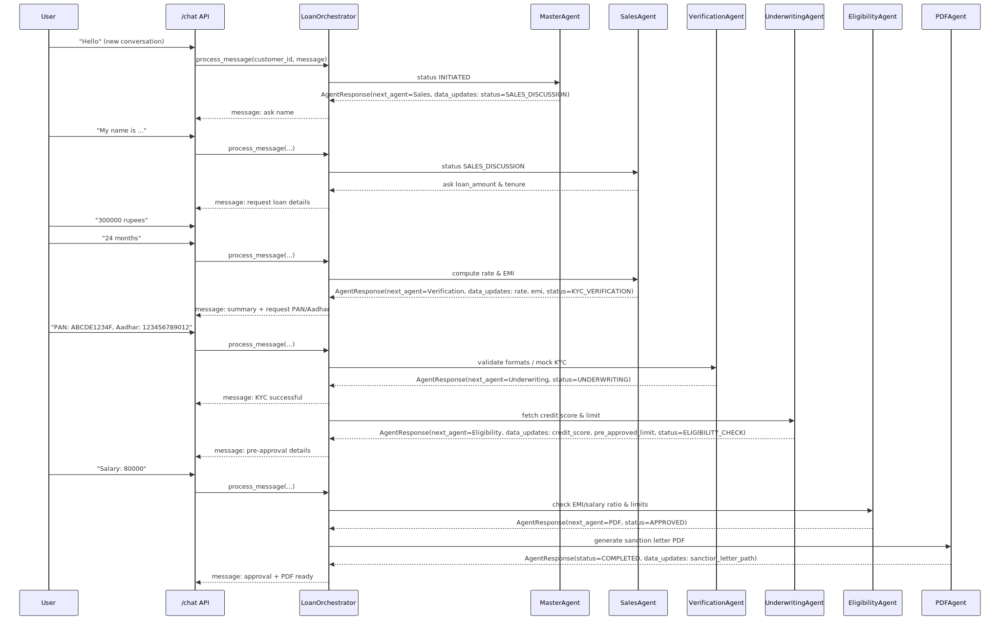

# AI Loan Processing System

## Agent Workflow Diagrams

The loan advisor workflow is documented with Mermaid diagrams and pre-rendered images.

- Full doc: `docs/agent_workflow.md`

Quick view images:

- State Machine
  - `docs/images/state-machine-loanstatus.svg`
  - 
- Conversation Sequence
  - `docs/images/sequence-conversation-via-chat.svg`
  - 
- Architecture Flow
  - `docs/images/architecture-orchestrator-and-agents.svg`
  - 

Tip: GitHub renders these SVGs directly. For PNG exports or re-rendering, use `python3 scripts/render_mermaid.py docs/agent_workflow.md docs/images svg,png` (fallbacks included), or run with `--local` after installing `@mermaid-js/mermaid-cli`.

A comprehensive AI-driven loan processing system with multiple specialized agents orchestrated through MCP (Model Context Protocol) server and exposed via FastAPI.

## Architecture

### Agents
- **Master Agent**: Initial customer interaction and loan interest generation
- **Sales Agent**: Loan details discussion (amount, rate, tenure)
- **Verification Agent**: KYC validation via mock APIs
- **Underwriting Agent**: Credit score fetching and assessment
- **Eligibility Agent**: Decision making based on credit score and loan amount
- **PDF Agent**: Sanction letter generation

### Workflow
1. Customer initiates chat → Master Agent welcomes and generates interest
2. Sales Agent discusses loan amount, tenure, calculates EMI
3. Verification Agent validates PAN/Aadhar through mock KYC APIs
4. Underwriting Agent fetches credit score and sets pre-approved limits
5. Eligibility Agent makes approval/rejection decisions
6. PDF Agent generates sanction letter for approved loans

## Quick Start

### 1. Install Dependencies
```bash
uv sync
```

### 2. Run the Server
```bash
uvicorn app:app --reload
```

### 3. Test the API
```bash
uv run python test_client.py
```

## API Endpoints

### POST /chat
Start or continue loan conversation
```json
{
  "customer_id": "CUST001",
  "message": "Hello",
  "application_id": "optional-for-continuing",
  "data_update": {"optional": "data"}
}
```

### GET /application/{app_id}
Get application details

### GET /sanction-letter/{app_id}
Download PDF sanction letter

### GET /health
Health check endpoint

## Example Usage

```python
import requests

# Start conversation
response = requests.post("http://localhost:8000/chat", json={
    "customer_id": "CUST001",
    "message": "Hello, I need a loan"
})

app_id = response.json()["application_id"]

# Continue conversation
response = requests.post("http://localhost:8000/chat", json={
    "customer_id": "CUST001",
    "application_id": app_id,
    "message": "My name is John Doe"
})
```

## Decision Logic

### Instant Approval
- Loan amount ≤ Pre-approved limit
- Credit score ≥ 700

### Conditional Approval
- Requires salary verification
- EMI ≤ 50% of salary

### Rejection Criteria
- KYC verification failure
- EMI > 50% of salary
- Credit score too low

## File Structure
```
├── agents/          # Agent implementations
├── models/          # Data models
├── services/        # MCP server and orchestrator
├── main.py          # FastAPI application
├── test_client.py   # Test client
└── sanction_letters/ # Generated PDFs
```