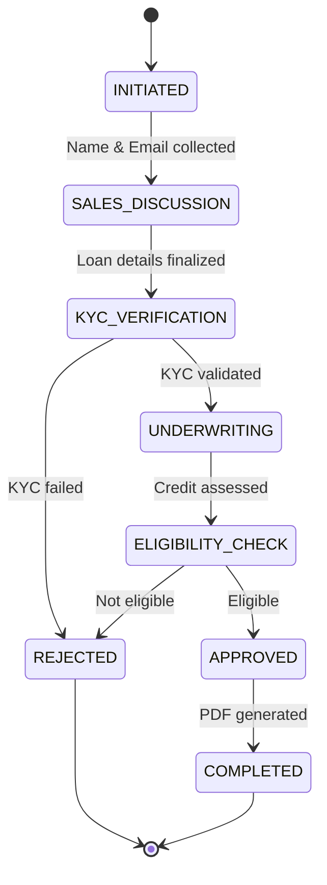

# AI Loan Processing System - Architecture

## System Overview

The AI Loan Processing System is a multi-agent conversational platform that automates the entire loan application process from initial customer interaction to sanction letter generation.

## Core Architecture

### 1. **Multi-Agent Design Pattern**

```
Customer → FastAPI → LoanOrchestrator → Agent → LLM → Response
```

Each agent specializes in a specific domain:
- **Separation of Concerns**: Each agent handles one workflow stage
- **Stateful Conversations**: Context maintained across interactions
- **Natural Language Processing**: LLM integration for human-like responses

### 2. **Technology Stack**

| Component | Technology | Purpose |
|-----------|------------|---------|
| **API Framework** | FastAPI | REST endpoints, async support |
| **LLM Integration** | Groq (Llama3-8B) | Natural language generation |
| **Data Models** | Pydantic | Type safety, validation |
| **File Storage** | Appwrite Cloud | PDF document storage |
| **Email Service** | Gmail API | Notification delivery |
| **Deployment** | AWS EC2 | Production hosting |

### 3. **Agent Orchestration**

#### **LoanOrchestrator** (`services/loan_orchestrator.py`)
- **Central Coordinator**: Routes messages between agents
- **State Management**: Maintains application lifecycle
- **Data Extraction**: Parses natural language inputs
- **Intent Recognition**: Determines appropriate agent routing

```python
# Orchestration Flow
message → extract_data() → route_by_intent() → get_current_agent() → process()
```

#### **Smart Data Extraction**
```python
# Examples of automatic extraction
"My name is John Doe" → application.customer.name = "John Doe"
"john@example.com" → application.customer.email = "john@example.com"  
"I need 5 lakh" → application.loan_amount = 500000
"24 months" → application.tenure_months = 24
"ABCDE1234F" → application.customer.pan = "ABCDE1234F"
```

#### **Intent-Based Routing**
```python
# Routing Logic
if not (name and email): → MasterAgent
elif loan_keywords: → SalesAgent  
elif pan_or_aadhar: → VerificationAgent
elif credit_score: → UnderwritingAgent
elif salary_or_approval: → EligibilityAgent
elif sanction_letter: → PDFAgent
```

## Agent Specifications

### 1. **MasterAgent** (`agents/master_agent.py`)
- **Role**: Customer onboarding and loan interest generation
- **Responsibilities**:
  - Welcome new customers
  - Collect name and email (mandatory)
  - Generate interest in loan products
  - Route to SalesAgent when ready

### 2. **SalesAgent** (`agents/sales_agent.py`)
- **Role**: Loan product discussion and EMI calculation
- **Responsibilities**:
  - Collect loan amount and tenure
  - Calculate EMI based on interest rate slabs
  - Present loan summary
  - Handle uncertainty with empathetic responses

**Interest Rate Slabs:**
```python
≤ ₹5,00,000: 10.5% p.a.
₹5,00,001 - ₹10,00,000: 11.5% p.a.
> ₹10,00,000: 12.5% p.a.
```

### 3. **VerificationAgent** (`agents/verification_agent.py`)
- **Role**: KYC document validation
- **Responsibilities**:
  - Validate PAN format (5 letters + 4 digits + 1 letter)
  - Validate Aadhar format (12 digits)
  - Mock KYC API integration
  - Success/failure determination

### 4. **UnderwritingAgent** (`agents/underwriting_agent.py`)
- **Role**: Credit assessment and risk evaluation
- **Responsibilities**:
  - Fetch credit score (mock API)
  - Set pre-approved limits based on credit score
  - Risk categorization

**Credit Score Mapping:**
```python
≥ 750: Pre-approved limit ₹10,00,000
700-749: Pre-approved limit ₹5,00,000  
650-699: Pre-approved limit ₹3,00,000
< 650: Pre-approved limit ₹1,00,000
```

### 5. **EligibilityAgent** (`agents/eligibility_agent.py`)
- **Role**: Final approval/rejection decision
- **Responsibilities**:
  - Apply business rules for approval
  - Calculate EMI-to-salary ratio
  - Make instant/conditional/rejection decisions

**Decision Matrix:**
```python
Instant Approval: loan_amount ≤ pre_approved_limit AND credit_score ≥ 700
Conditional: EMI ≤ 50% of monthly_salary
Rejection: EMI > 50% of salary OR KYC failure
```

### 6. **PDFAgent** (`agents/pdf_agent.py`)
- **Role**: Document generation and notification
- **Responsibilities**:
  - Generate sanction letter PDF
  - Upload to Appwrite cloud storage
  - Send email notification with document link
  - Mark application as completed

## Data Flow Architecture

### 1. **Application State Machine**



### 2. **Request/Response Flow**

```
1. POST /chat → LoanOrchestrator.process_message()
2. Extract data from message → Update LoanApplication
3. Route by intent → Determine current agent
4. Agent.process() → Generate response using LLM
5. Apply data_updates → Update application state
6. Chain to next_agent if specified
7. Return AgentResponse → Format as ChatResponse
```

### 3. **Data Models** (`models/loan_models.py`)

```python
LoanApplication:
  - application_id: str
  - customer: Customer
  - loan_amount: float
  - tenure_months: int
  - interest_rate: float
  - emi: float
  - status: LoanStatus
  - sanction_letter_path: str

Customer:
  - customer_id: str
  - name: str
  - email: str
  - pan: str
  - aadhar: str
  - salary: float
```

## Integration Points

### 1. **External Services**

#### **Groq LLM API**
- **Purpose**: Natural language response generation
- **Model**: Llama3-8B-8192
- **Fallback**: Hardcoded responses if API fails

#### **Appwrite Cloud Storage**
- **Purpose**: PDF document storage and retrieval
- **Features**: File upload, public URL generation

#### **Gmail API**
- **Purpose**: Email notifications
- **Authentication**: OAuth2 with service account

### 2. **Mock APIs**
- **KYC Validation**: Simulated success/failure (configurable rate)
- **Credit Score**: Random generation within realistic ranges
- **Salary Verification**: Future enhancement placeholder

## Security & Configuration

### 1. **Environment Variables**
```bash
GROQ_API_KEY=<llm_api_key>
API_ENDPOINT=<appwrite_endpoint>
PROJECT_ID=<appwrite_project>
APPWRITE_API_KEY=<appwrite_key>
BUCKET_ID=<storage_bucket>
NO_REPLY_EMAIL=<sender_email>
MAIL_PASSWORD=<app_password>
AWS_EC2_URL=<production_url>
```

### 2. **CORS Configuration**
- Supports multiple origins (localhost, Vercel, AWS)
- Wildcard support for development
- Credentials enabled for authenticated requests

## Deployment Architecture

### 1. **Development Environment**
```bash
uvicorn app:app --reload  # Local development server
```

### 2. **Production Environment**
- **Platform**: AWS EC2 instance
- **URL**: `http://ec2-43-204-232-206.ap-south-1.compute.amazonaws.com`
- **Frontend**: Vercel deployment at `https://synfin.vercel.app`

### 3. **Scalability Considerations**
- **Stateless Design**: Each request is independent
- **Horizontal Scaling**: Multiple instances can run concurrently
- **Database Migration**: Currently in-memory, ready for persistent storage
- **Caching**: LLM response caching for common queries

## Performance Characteristics

### 1. **Response Times**
- **Agent Processing**: < 500ms
- **LLM Generation**: 1-3 seconds
- **PDF Generation**: 2-5 seconds
- **Email Delivery**: 3-7 seconds

### 2. **Throughput**
- **Concurrent Users**: 50+ (single instance)
- **Requests/Second**: 10-20 (with LLM calls)
- **Memory Usage**: ~200MB per instance

## Monitoring & Observability

### 1. **Health Endpoints**
```bash
GET /health          # System health check
GET /application/{id} # Application state inspection
```

### 2. **Logging Strategy**
- **Agent Transitions**: State change logging
- **LLM Interactions**: Request/response logging
- **Error Handling**: Comprehensive exception tracking

This architecture provides a robust, scalable foundation for automated loan processing while maintaining flexibility for future enhancements and integrations.