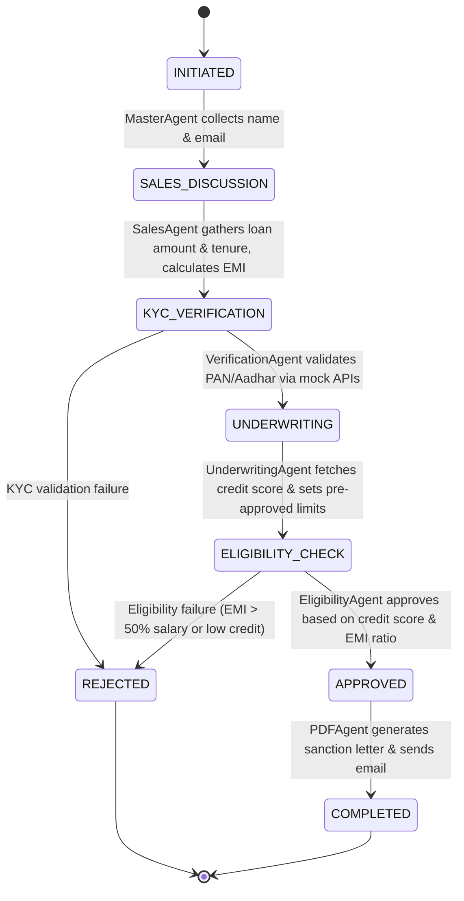
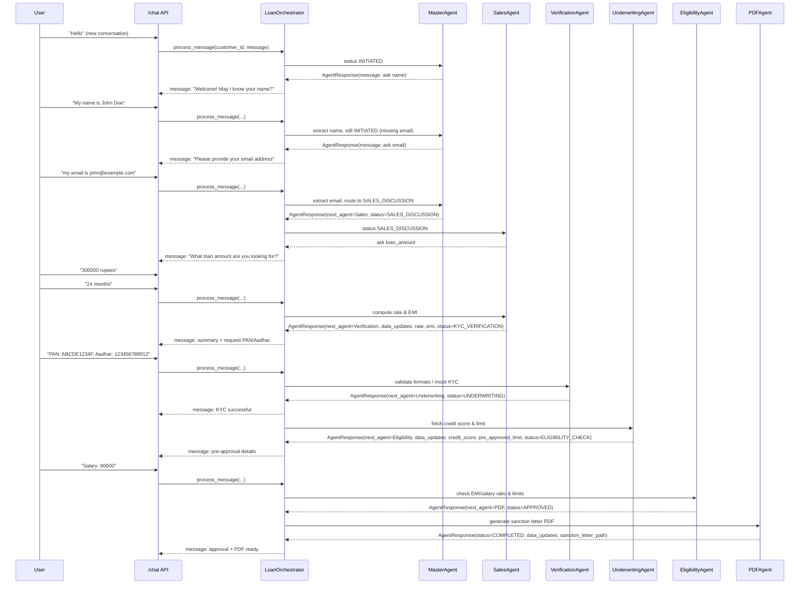
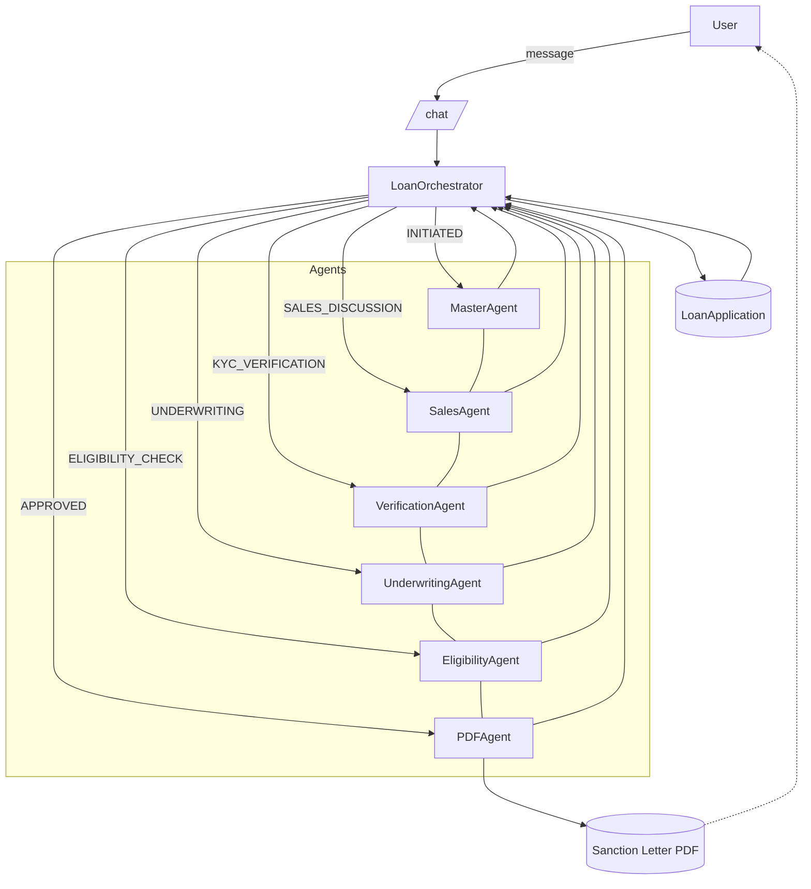

# Agent Workflow Diagrams

This document visualizes the end‑to‑end flow of the AI Loan Processing system, including state transitions, agent orchestration, and request sequencing.

## State Machine (LoanStatus)

## Sequence: Conversation via /chat

## Architecture: Orchestrator and Agents

## Agent Orchestration Details

### How Agents Work Together

1. **LoanOrchestrator** acts as the central coordinator:
   - Routes messages to appropriate agents based on `LoanStatus`
   - Extracts data from user messages using smart parsing
   - Manages application state transitions
   - Handles agent chaining for seamless flow

2. **Smart Data Extraction**:
   - **Names**: "My name is X", "I am X" → `application.customer.name`
   - **Email**: Email regex pattern → `application.customer.email`
   - **Loan Amount**: "5 lakh", "300000" → `application.loan_amount`
   - **Tenure**: "24 months", "2 years" → `application.tenure_months`
   - **PAN/Aadhar**: Format validation → `application.customer.pan/aadhar`

3. **Intent-Based Routing**:
   - **Sales Intent**: Keywords like 'loan', 'amount', 'EMI' → SalesAgent
   - **Verification Intent**: PAN/Aadhar provided → VerificationAgent
   - **Underwriting Intent**: 'credit score' mentioned → UnderwritingAgent
   - **Eligibility Intent**: 'salary', 'approval' → EligibilityAgent

4. **Agent Responsibilities**:
   - **MasterAgent**: Welcome, collect name & email, generate loan interest
   - **SalesAgent**: Discuss loan details, calculate EMI, set interest rates
   - **VerificationAgent**: Validate KYC documents via mock APIs
   - **UnderwritingAgent**: Fetch credit score, set pre-approved limits
   - **EligibilityAgent**: Make approval/rejection decisions
   - **PDFAgent**: Generate sanction letter, send email notification

5. **Decision Logic**:
   - **Instant Approval**: Loan ≤ Pre-approved limit + Credit score ≥ 700
   - **Conditional Approval**: EMI ≤ 50% of salary
   - **Rejection**: KYC failure OR EMI > 50% salary OR low credit score

### Notes
- The orchestrator maintains conversation context across multiple API calls
- Agents can chain together (e.g., Sales → Verification) for smooth user experience
- All business logic is configurable through agent implementations
- System handles natural language variations and extracts structured data automatically

## Pre‑Rendered Images
- State Machine: 
- Conversation Sequence: 
- Architecture Flow: 