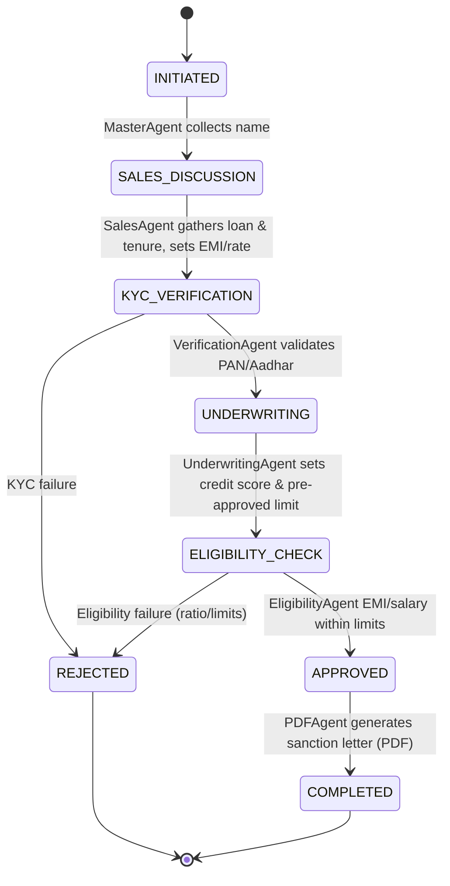
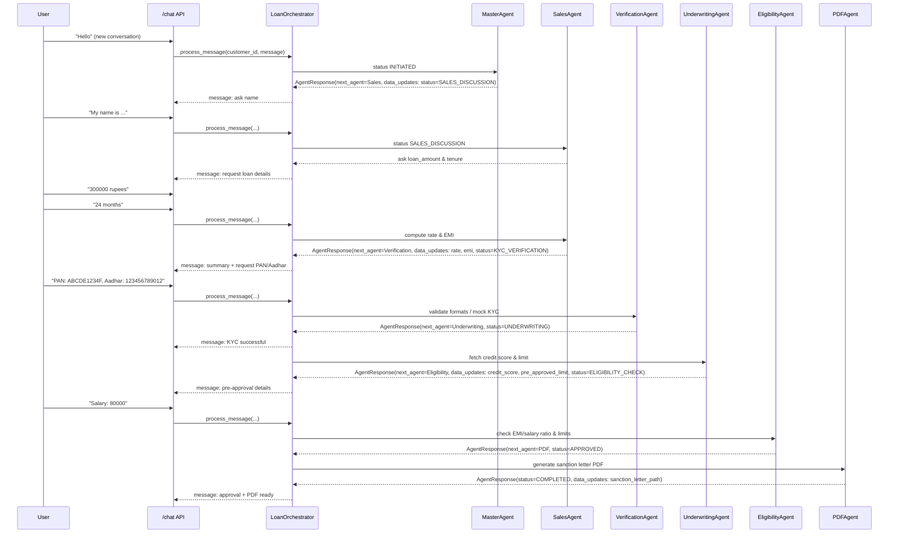
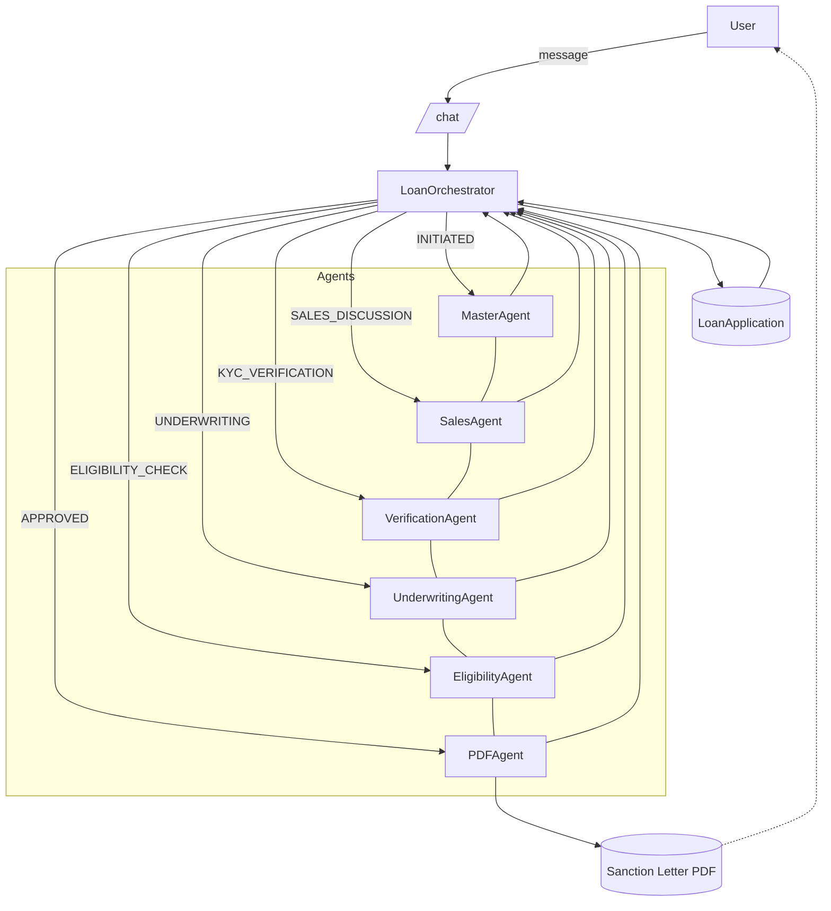

# Agent Workflow Diagrams

This document visualizes the end‑to‑end flow of the Loan Advisor system, including state transitions, agent orchestration, and request sequencing.

## State Machine (LoanStatus)

## Sequence: Conversation via /chat

## Architecture: Orchestrator and Agents

## Notes
- The orchestrator selects the agent based on `LoanStatus`, applies `AgentResponse.data_updates`, and may auto-advance to `next_agent` to reduce user steps.
- Failures (KYC or eligibility) set `status=REJECTED` with a `rejection_reason` and end the flow.
- `PDFAgent` finalizes approval by generating a sanction letter and setting `status=COMPLETED`.

## Pre‑Rendered Images
- State Machine: 
- Conversation Sequence: 
- Architecture Flow: 